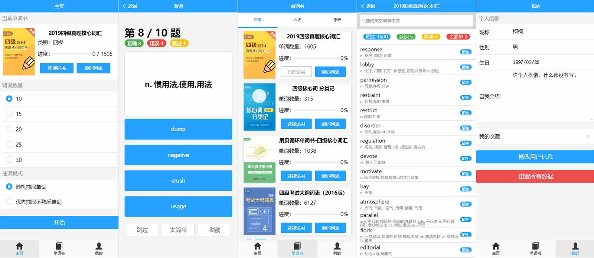

# 项目说明



这是我用 Vue 编写的英语单词学习应用。因其中的单词数据爬取自扇贝网，故取名“擅背单词”以示敬意。该应用拥有背诵单词、收藏单词、检索单词、切换词书、储存进度、修改和存储用户信息等功能。该应用使用 localStorage 保存背词进度和用户信息，所以进度会保存到本地。
技术栈：Vue + Vue-Router + Mint-UI + Python(爬虫)。

```shell
# 框架
Header 导航栏
Main 主页面
|-- Home 主页
  |-- Wordbook 单词书
    |-- Wordlist 单词列表
  |-- Learn 背词
|-- Lexicon 词库
  |-- Wordbook 单词书
    |-- Wordlist 单词列表
|-- User 用户
  |-- Wordlist 单词列表
Tabbar 底部导航栏
```

安装和运行：

```shell
npm install # 安装模块
npm run serve # 编译项目
npm run build # 构建项目
```

[点我进入演示地址](http://works.kexiaolong.top/shanbay-lexicon/)。

如果喜欢的话请点一个 Star 哦！
